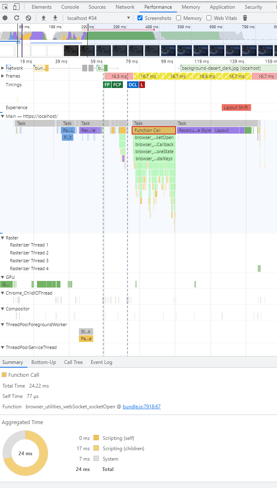
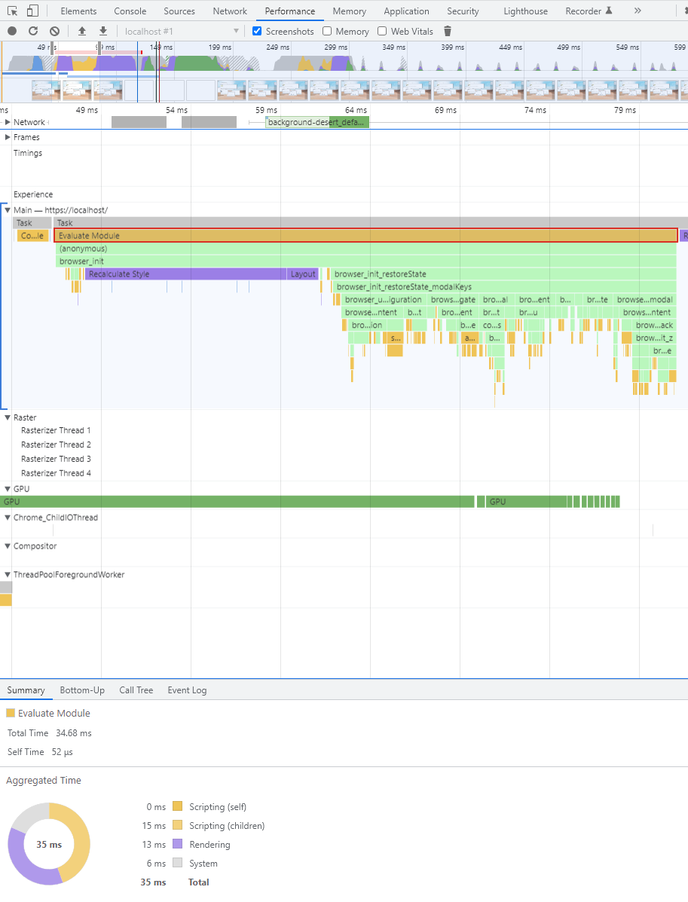
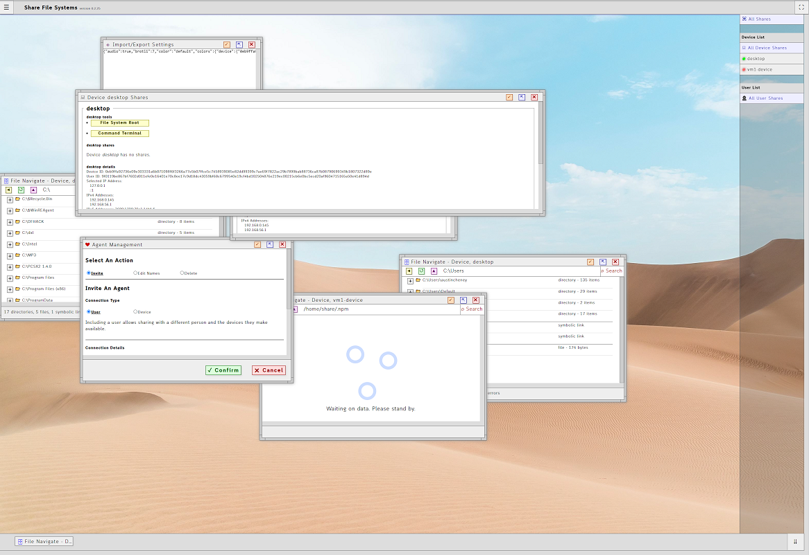

# Execution Performance - Browser
Written 18 February 2023. Updated 25 February 2023.

<!-- cspell: words protobuf, SODIMM, unminified, WHATWG, Xeon -->

In a personal project, a single page application, I am able to load my application as fast as **80ms**.
This application displays as the equivalent of an operating system GUI of 7 windows open with full state restoration.
This document discusses how I did it and what that means for human engagement.
I have listed screenshots of the performance graph at the bottom of the document.

## Raw Data
All speed measurements obtained from the *Performance* tab of Chrome Developer Tools and payload sizes obtained form the *Network* tab.

* Application
   * Source - https://github.com/prettydiff/share-file-systems
   * Browser Payload Size
      * HTML - 1 File - 10.5kb
      * CSS - 1 File - 411kb (unminified)
      * JS - 1 File - 526kb (unminified)
      * Images - 2 Files - 3.8mb
    * Domain - localhost
    * Framework/Tools - None
    * Language - TypeScript
* Machine - Desktop
   * OS - Windows 10.0.19044
   * CPU - Intel Xeon E5-1660 @ 3.3GHz (6 Cores)
   * Memory - 64GB DDR3 @ 1333MHz
   * GPU - NVidia GeForce GTX 1650 - driver version 528.49
   * Application Load Speed (Fastest) - 79.87ms
   * Application Load Speed (Average of 10 Loads) - 88.67ms
   * State Restoration Logic (Fastest) - 21ms
   * State Restoration Logic (Average of 10 Loads) - 25ms
   * Browser - Chrome 110.0.5481.178
* Machine - Laptop
   * OS - Windows 10.0.19044
   * CPU - Intel Core i7-7500U @ 2.7Ghz (2 Cores)
   * Memory - 16GB SODIMM @ 2133MHz
   * GPU - Intel HD Graphics 620
   * Application Load Speed (Fastest) - 134.47ms
   * Application Load Speed (Average of 10 Loads) - 149.31ms
   * State Restoration Logic (Fastest) - 20ms
   * State Restoration Logic (Average of 10 Loads) - 32ms
   * Browser - Chrome 110.0.5481.178

For sake of transparency the page was loaded from a localhost domain, which allowed the page assets to download within the first 30ms, because it is coming from a service running on the same computer.
Even with consideration for download across the continental United States the total transmission time would take less than 100ms on a 1 gigabit fiber connection, which means the page would still come with full render and state restoration in less than a quarter second.

### Session Data
For the same reproduction I am including the session data I used for these measurements with file system paths relative to the application root.

* `/lib/settings/configuration.json`
   ```json
   {"audio":true,"brotli":7,"color":"default","colors":{"device":{"0eb9ffa92736e09e303331a6b071098f6f3266a77e5b07ffce5c7458939085e82dd99399c7ae69f7822ac29b7899bab88736ca87b08790699349b1807322d89e":["fff","eee"],"754ba418d2f79a429e40a2969cfd37e1fe53acba499e5fbdcc4a781ece28906649b1f45af6c498b24c20eb8752fc760f120e9c33562b595cbeee02dc336b03c3":["fff","eee"]},"user":{}},"fileSort":"file-system-type","hashDevice":"0eb9ffa92736e09e303331a6b071098f6f3266a77e5b07ffce5c7458939085e82dd99399c7ae69f7822ac29b7899bab88736ca87b08790699349b1807322d89e","hashType":"sha3-512","hashUser":"9f0119be867bf7602d011efe0e16401e70c8ee17c9d18dc43059bf68c6799540e19cf4bd102504876e219ec00215cb6e0bc5ecd20af9604715165a50e41d894d","minimizeAll":false,"modals":{"configuration-modal":{"agent":"0eb9ffa92736e09e303331a6b071098f6f3266a77e5b07ffce5c7458939085e82dd99399c7ae69f7822ac29b7899bab88736ca87b08790699349b1807322d89e","agentIdentity":false,"agentType":"device","content":{},"id":"configuration-modal","read_only":false,"single":true,"status":"hidden","type":"configuration","height":1094,"left":1124,"top":682,"width":569,"zIndex":9,"inputs":["close"]},"file-navigate-0.2936007454935674221":{"agent":"0eb9ffa92736e09e303331a6b071098f6f3266a77e5b07ffce5c7458939085e82dd99399c7ae69f7822ac29b7899bab88736ca87b08790699349b1807322d89e","agentIdentity":true,"agentType":"device","content":{},"footer":{},"inputs":["close","maximize","minimize","text"],"read_only":false,"selection":{},"share":"","text_placeholder":"Optionally type a file system address here.","text_value":"C:\\MP3","title_supplement":"","type":"file-navigate","width":800,"zIndex":6,"left":245,"top":131,"height":400,"status":"minimized","id":"file-navigate-0.2936007454935674221","search":["","jain"],"history":["**root**","G:\\","G:\\VM","G:\\VM\\VM1","G:\\VM","G:\\","\\","K:\\","K:\\Games","C:\\","C:\\MP3","C:\\MP3\\Electronic","C:\\MP3","C:\\MP3\\Alternative","C:\\MP3","C:\\","C:\\Windows","C:\\","C:\\MP3","C:\\MP3\\Comedy","C:\\MP3","C:\\MP3\\Theatrical","C:\\MP3"],"focus":{}},"shares-0.9307572827545383231":{"agent":"0eb9ffa92736e09e303331a6b071098f6f3266a77e5b07ffce5c7458939085e82dd99399c7ae69f7822ac29b7899bab88736ca87b08790699349b1807322d89e","agentIdentity":true,"agentType":"device","content":{},"inputs":["close","maximize","minimize"],"read_only":false,"type":"shares","width":800,"zIndex":5,"left":829,"top":364,"height":400,"status":"normal","id":"shares-0.9307572827545383231"},"agent-management-0.13696002399352003251":{"agent":"0eb9ffa92736e09e303331a6b071098f6f3266a77e5b07ffce5c7458939085e82dd99399c7ae69f7822ac29b7899bab88736ca87b08790699349b1807322d89e","agentIdentity":false,"agentType":"device","content":{},"inputs":["cancel","close","confirm","maximize","minimize"],"read_only":false,"single":true,"type":"agent-management","width":750,"zIndex":4,"left":289,"top":804,"height":400,"status":"normal","id":"agent-management-0.13696002399352003251"},"file-navigate-0.51026166001780251":{"agent":"754ba418d2f79a429e40a2969cfd37e1fe53acba499e5fbdcc4a781ece28906649b1f45af6c498b24c20eb8752fc760f120e9c33562b595cbeee02dc336b03c3","agentIdentity":true,"agentType":"device","content":{},"footer":{},"inputs":["close","maximize","minimize","text"],"read_only":false,"selection":{},"share":"","text_placeholder":"Optionally type a file system address here.","text_value":"/home/share/.npm","title_supplement":"","type":"file-navigate","width":800,"zIndex":3,"left":935,"top":1005,"height":400,"status":"normal","id":"file-navigate-0.51026166001780251","search":["",""],"history":["**root**","/home","/home/share","/home/share/Downloads","/home/share","/home/share/.npm"],"focus":{}},"export-0.0997164931469116751":{"agent":"0eb9ffa92736e09e303331a6b071098f6f3266a77e5b07ffce5c7458939085e82dd99399c7ae69f7822ac29b7899bab88736ca87b08790699349b1807322d89e","agentIdentity":false,"agentType":"device","content":{},"inputs":["cancel","close","confirm","maximize","minimize"],"read_only":false,"single":true,"type":"export","zIndex":7,"left":363,"top":82,"width":565,"height":400,"status":"normal","id":"export-0.0997164931469116751"},"file-navigate-0.2081472332522305101":{"agent":"0eb9ffa92736e09e303331a6b071098f6f3266a77e5b07ffce5c7458939085e82dd99399c7ae69f7822ac29b7899bab88736ca87b08790699349b1807322d89e","agentIdentity":true,"agentType":"device","content":{},"footer":{},"inputs":["close","maximize","minimize","text"],"read_only":false,"selection":{},"share":"","text_placeholder":"Optionally type a file system address here.","text_value":"C:\\Users","title_supplement":"","type":"file-navigate","width":800,"zIndex":2,"left":1438,"top":867,"height":400,"status":"normal","id":"file-navigate-0.2081472332522305101","search":["",""],"history":["**root**","/","C:\\","C:\\MP3","C:\\","C:\\Users","C:\\Users\\austincheney","C:\\Users"],"focus":{}},"file-navigate-0.9333835963041073141":{"agent":"0eb9ffa92736e09e303331a6b071098f6f3266a77e5b07ffce5c7458939085e82dd99399c7ae69f7822ac29b7899bab88736ca87b08790699349b1807322d89e","agentIdentity":true,"agentType":"device","content":{},"footer":{},"inputs":["close","maximize","minimize","text"],"read_only":false,"selection":{},"share":"","text_placeholder":"Optionally type a file system address here.","text_value":"C:\\","title_supplement":"","type":"file-navigate","width":800,"zIndex":1,"left":-4,"top":574,"height":400,"status":"normal","id":"file-navigate-0.9333835963041073141","search":["",""],"history":["**root**","K:\\","C:\\"],"focus":{}},"shares-0.882680345450007681":{"agent":"0eb9ffa92736e09e303331a6b071098f6f3266a77e5b07ffce5c7458939085e82dd99399c7ae69f7822ac29b7899bab88736ca87b08790699349b1807322d89e","agentIdentity":true,"agentType":"device","content":{},"inputs":["close","maximize","minimize"],"read_only":false,"type":"shares","width":1674,"zIndex":11,"left":272,"top":272,"height":404,"status":"normal","id":"shares-0.882680345450007681"}},"modalTypes":["configuration","file-navigate","shares","agent-management","export"],"nameDevice":"desktop","nameUser":"Austin","statusTime":15000,"storage":"C:\\Users\\austincheney\\share-file-systems\\lib\\storage\\","tutorial":false,"zIndex":11}
   ```
* `/lib/settings/device.json`
   ```json
   {"0eb9ffa92736e09e303331a6b071098f6f3266a77e5b07ffce5c7458939085e82dd99399c7ae69f7822ac29b7899bab88736ca87b08790699349b1807322d89e":{"deviceData":{"cpuCores":12,"cpuID":"Intel(R) Xeon(R) CPU E5-1660 0 @ 3.30GHz","platform":"win32","memTotal":68639502336,"osType":"Windows_NT","osVersion":"10.0.19044"},"ipAll":{"IPv4":["192.168.0.145","192.168.56.1"],"IPv6":["2600:1700:70e1:14bf::3"]},"ipSelected":"192.168.56.1","name":"desktop","ports":{"http":443,"ws":444},"shares":{},"status":"active"},"754ba418d2f79a429e40a2969cfd37e1fe53acba499e5fbdcc4a781ece28906649b1f45af6c498b24c20eb8752fc760f120e9c33562b595cbeee02dc336b03c3":{"deviceData":{"cpuCores":1,"cpuID":"Intel(R) Xeon(R) CPU E5-1660 0 @ 3.30GHz","platform":"linux","memTotal":8341577728,"osType":"Linux","osVersion":"5.11.0-40-generic"},"ipAll":{"IPv4":["10.0.2.15","192.168.56.101"],"IPv6":[]},"ipSelected":"192.168.56.101","name":"vm1-device","ports":{"http":443,"ws":444},"shares":{},"status":"offline"}}
   ```
* `/lib/settings/user.json` - empty

## Second and Third Order Consequences
Before talking further about performance it must be stated that increased performance in one area frequently results in increased performance in other areas.
Likewise, poor performance in one area may likely contribute to slower performance in other areas.
I refer to this as the *compounding effect*, and its extremely challenging to measure or identify.

The most important thing to bear in mind with consideration of second/third order consequences and various compounding effects is the phenomenon of **amplification**.
Amplification means two similar things:
1. To build upon ones self as to grow or increase.
2. A consequence spread across steps or stages which may appear small in isolation but enormous in total.

Once a decision or point of execution occurs the immediate loss or gain to performance might be recoverable elsewhere, but the result of the various compounding effects is permanent due to the nature of amplification.
Actions without considerations for amplification may result in unseen [Pyrrhic Victories](https://en.wikipedia.org/wiki/Pyrrhic_victory).
The inability to accept the nature of amplification will certainly result in a variety of [logical fallacies](https://en.wikipedia.org/wiki/List_of_fallacies), most commonly: equivocation, sunk cost, and single cause.

The ultimate conclusion to thinking in terms of amplification most commonly results in thoughts of building from solid foundations.
It is unknown what defines a solid foundation as this can only be learned from experience through critical doubt, measurements, and comparisons.
Due to the compounding, and possibly unseen, nature of amplification the ultimate logical conclusion is that any single decision is cheap in the immediate and expensive in the future.
For persons intentionally focused upon mastering control of amplification three actions result:
1. All things are frequently measured, which may require the invention of new tools.
2. Humility. A person must quickly admit when they are in error, because righteousness and [conservatism bias](https://en.wikipedia.org/wiki/Conservatism_(belief_revision)) are terminal distractions when chasing a superior measure.
3. Everything is open to isolation, decoupling, and frequent refactoring as these are the means to counter-attack compounding effects.

Those three behaviors comprise what I call the **Solid Foundation First Mindset**.

## Application Code
### TypeScript
I wrote the application in TypeScript.
The most immediate performance advantage offered by TypeScript is rapid identification of unintended type recasting of variables and object properties storing primitive data types.
Modern JavaScript, which TypeScript compiles to, executes as a compiled byte code in a low level virtual machine.
As a byte code the compiled code must be as predictable as possible to execute quickly.
Type recasting forces the compiler to reject the entirety of the most local function at run time and to instead execute the code in a static string interpreter.
Getting primitive types correct and keeping them static offers both immediate benefits in performance measures and a variety of compounding effects.

The most amazing advantages proffered from TypeScript are in regards to formal type definitions of complex types, such as objects and arrays.
These definitions, typically expressed as *interfaces*, eliminate guessing and uncertainty in the building and shaping of various data passed between systems, which results in a variety of compounding effects.

### Frameworks
The application makes no use of a JavaScript framework.
Frameworks provide numerous advantages that speed an application to market, but they also provide artificial constraints which establish a higher level technology foundation.
The most commonly stated business qualification of frameworks I have observed is to prevent *reinventing of wheels*, which is to say that frameworks provide solutions to known problems.
That is the business principle of *risk mitigation* such that potential technical challenges are eliminated through use of common solutions.

Unfortunately, risk mitigation in the manner of reliance upon shared solutions is completely counter to the nature of a solid foundation first mindset.
This conflict stems from the inability to discern standards from implementations.
A standard defines a set of rules approved by a committee whereas an implementation constitutes the execution of an idea, standard, or principle.
When a standard is conjoined to an implementation the standard cannot be measured or tested independent of its implementation.
The lost opportunity to objectively measure and compare one criteria to another results in [bias](https://en.wikipedia.org/wiki/Bias) which defeats humility.

For example Bank of America primarily relied upon a single internal standard to maintain ethical correctness: The Risk Mitigation Framework.
This framework is an internal standard approved by a dedicated committee presided over by a dedicated senior executive.
The purpose of the framework served not as a tool to execute decisions, but as strict guidance for the formulation of leadership, policies, legal guidance, and conduct.
In this case the framework is clearly not a tool to execute but the standard rules by which implementations are required to adhere.
Since, in this example, the standard is independent of the various implementations upon it the standard is open to refactoring and measuring without consideration or bias to any of those implementations.

The application accepts the [Document Object Model](https://developer.mozilla.org/en-US/docs/Web/API/Document_Object_Model), or DOM, as its primary technology foundation in the browser.
The DOM provides a portable tree model for the organization of data where each data point is a *node*.
The DOM is accessed through JavaScript, but is external and independent from JavaScript.
In many ways the DOM is perfectly analogous to a file system in that a file system is a tree model accessed through an operating system, but independent and portable from the operating system.

Access to the DOM is fast according to this speed test: https://jsbench.github.io/#b39045cacae8d8c4a3ec044e538533dc
On my desktop computer in Chrome I observe about 22.5 million operations per second which is half as fast as Chrome was more than 4 to 5 years ago.
On the same computer Firefox achieves about 880 million operations per second which is exactly was fast as Firefox was over the same time period.
This access speed is certainly slower than the nanosecond performance speed of executing JavaScript instructions, but not slow enough to consider the DOM a performance bottleneck as many people falsely do.

## State Data
One technique I use to increase performance it to embed state data directly into the HTML code.
Otherwise a user must download the HTML code, wait for the JavaScript to fully load, then issue a network request for state data, wait for the data to return the browser, and then execute that state data.
That presents numerous problems.
The two largest of those problems comprise waiting for an additional network roundtrip and visually repainting the page.

When the state data is directly embedded in the HTML the only additional step imposed upon the initial JavaScript execution is the extraction of that state data from the DOM.
The JavaScript executing at page load has access to the state data as soon as it can execute, which further means state restoration is part of the initial page paint.

I tried two techniques for embedding state data into the HTML: comments and input tags of type hidden.
I was not able to measure any performance differences in the browser between those two approaches.
I ultimately chose to use a hidden input tag, because even though there is no practical performance difference between the approaches accessing a comment from the DOM requires a specialized technique that measured slower in the JSBench link of the prior section.

## String Parsing
String parsing is perhaps the greatest villain to performance.
In isolation string parsing using a standard convention does not appear to be slow, but practical performance considerations do not account for instruction isolation.
Examples of automated string parsing in the browser include: assignments to innerHTML, query selectors, console.log, JSON.stringify, and so forth.
I shaved 100ms of load time off my application by eliminating use of assignment to innerHTML.
Query selectors are several orders of magnitude slower than searching the DOM using other standard methods and/or relational properties.

The solution to eliminating use of JSON.stringify, at least for network traffic, is gRPC from Google.
Google claims gRPC is 10 times faster than JSON over HTTP and I agree with their assessment.
gRPC makes using of binary data payloads in a format called *protobuf* over a single TCP socket, which in the browser means [WebSockets](https://developer.mozilla.org/en-US/docs/Web/API/WebSockets_API).

## Logging
Any logging to the console or terminal imposes a measurable performance penalty.
With consideration for compounding effects numerous uses of console.log can add substantial time to a page load.
I continue to use logging as my prior means of debugging and code investigation, but ensure logging is limited to debugging.
To accomplish this I use an ESLint rule to error on any use of console.log with exceptions for a few files dedicated for logging output.
I wrote a small library to perform console.log on the terminal, which in Node is a convenience method over `process.stdout`.
I also wrote extended console.log in the browser so that any troubleshooting occurring in the browser is reported to Node for logging in the terminal in case I am not able to see it in the browser even with persistent logging enabled from the developer tools.

## Transmission
In the application I have chosen to not use gRPC because I have found protobuf to be extremely inconvenient.
I have eliminated use of HTTP, except for page load, in favor of WebSockets though, both in and outside the browser, and noticed about 7 times speed improvement from that alone.
I measured that performance difference in observing my test automation which instantly reduced from about 45 seconds to as low as 6.22 seconds running the same tests.

WebSockets are a transmission protocol standard currently defined as [RFC 6455](https://www.rfc-editor.org/rfc/rfc6455).
The browser provides a native interface to partially access the WebSocket protocol, which is maintained as a standard interface by the [WHATWG](https://websockets.spec.whatwg.org/).
That means no third party code is required to connect, send, or receive with WebSockets in the browser.
There are many well supported libraries to execute and access WebSockets with Node.js, but for security and performance reasons I chose to [write my own](https://github.com/prettydiff/share-file-systems/blob/master/lib/terminal/server/transmission/transmit_ws.ts).

There are several reasons to explain the monumental performance difference between HTTP and WebSockets.
An HTTP transmission comprises a network round trip.
A client sends a request and a serve then sends a response.
With WebSockets there is no round trip.
There is only send and receive.

WebSockets require a dedicated open TCP/TLS socket, which makes it a session oriented protocol.
Each HTTP request creates a new socket where the client is always anonymous to the server, which makes HTTP inherently session-less.
The session-less nature of HTTP is its greatest strength that allows HTTP operate where many other protocols cannot, but this imposes a large performance penalty.

WebSocket protocol transmits data as binary buffers in segments called *frames* with each frame containing a header of length 2-14 bytes.
Message payloads may optionally be divided amongst multiple frames as necessary to reduce network congestion and transmission reliability.
HTTP offers no internal segmentation mechanism, which can result in a burst of enormous payload sizes.
HTTP headers are also strings that require string parsing, which takes extra time, and large often averaging at 1kb in length.

I saved about 20ms by ensuring I did not accidentally open additional connections out of the browser and by pushing socket connection until after state restoration.
There are costs and benefits to pushing out socket connections to later in the application load.
Before the first two things I was doing in the JavaScript was adjusting the presentation of the page which caused a minor repaint and opening a WebSocket connection.
All other logic executed from a callback to the WebSocket open, which comprised a delay of about 12-15ms.
When the socket connection opened as early as possible the application received and fully rendered file system information in the page from the Node.js service in about 210ms and 240ms respectively.
After moving the socket connection to after state restoration that same file system information fully rendered in about 300ms and 350ms respectively after the garbage collection heartbeat started in the page.

## Images
In the application I have chosen to eliminate use of images except large background wallpaper images.
In place of images I am using Unicode icons, which are text characters.
Since most modern software is at least UTF8 by default, JavaScript is UTF16 and many browsers and editors partially support UTF32, these icons can be embedded as text literals without need for character entity references.
This means embedding and reading these icons directly in code editors and in the browser without at form of translation at a size of 1-4 bytes.

## Bundling
I did noticed a low, but measurably significant performance improvement from bundling my JavaScript and CSS code into single files.
For performance reasons I [wrote my own application specific bundler](https://github.com/prettydiff/share-file-systems/blob/master/lib/terminal/commands/library/build.ts#L241-L392) that is a single step in my build tool.

## State Management
Unlike many popular frameworks I chose not to architect the application with the concept of components in mind.
That results in phenomenally lower complexity, at the consequence of managing state globally using a single state management artifact.
That, a single global artifact for managing all application state, sounds like it should become a problem open to all manners of collision or at least a performance bottleneck.
There are two points of potential collision that I have found, both completely outside the application, and have I found ways to mitigate these concerns.

### Collision Potential
The first point of potential collision is the browser's standard WebSocket interface.
It takes time to encode a string into a binary buffer, build the frame header, and execute the transmission send method.
That happens very quickly, possibly in less than a millisecond, but JavaScript instructions execute in less than a nanosecond.
If instructions to send data over WebSockets execute too quickly there will be a collision, because the [browser interface does not account for or provide any form of message queueing](https://github.com/whatwg/websockets/issues/33).
To minimize the risk of such collisions in my application I impose a 25ms delay only on state management transmissions, so that if a single function sends both a specified data message and a state update they will not clobber each other.

The application writes state data to a file in the local computer's file system.
Opening files costs more performance time than other file system operations.
File systems comprise two data sets: a tree and a storage area (partition).
Accessing and navigating the file system tree is extremely fast as this data structure typically resides in memory where file contents reside on disk.
In order to write to an existing file the existing file must be opened such that writing new content either overwrites the existing contents or appends to the existing contents.

This means an application can receive instructions to update a file faster than such data can be written to that file.
In order to solve for this state artifacts are always written to a new file with a random name, which means multiple state files might be written simultaneously if the instructions to do so are executed quickly enough.
Then once the file is written it is renamed to the official file name retaining the state data, because file renaming is an extremely fast and non-regressive collisions file writing collisions are eliminated.

### Restoration
Since there is only one single global state artifact the application only reads from it once: at page load/refresh.
Never again does the browser side of the application need to read from the state artifact, but the state artifact is frequently updated as the user interacts with the application.

Outside the browser the application only reads from the state artifact when the application executes from the shell.
Otherwise the state artifact is assigned to a variable ready to be dynamically embedded into the HTML file on each HTTP request from the browser.
Up to a few months ago I was opening the state files and reading the state data on each browser request, which cost an additional 70ms of load time.

## Screen Thrashing
Some visual updates result in page repainting which is slow, but some visual updates do not.
Typically changes to background color, text color, and opacity will not result in page repainting.
Changes that result in display or hiding elements, moving elements, changes to element dimensions, and changes to text size or position all result in page repainting and will extend a page's load time.
At this point about 40% of my application page's load time is waiting on visual rendering of artifacts outside of JavaScript instructions.

There is one CSS trick that has helped me save a lot of screen repainting.
Always put as much presentation instructions as possible in CSS files and load those files into the page's `<head>` tag before the `<body>`.
That way the CSS is applied to the HTML on the initial paint, but there are times when element dimensions must be dynamically calculated, which requires use of JavaScript and will always impose repainting.
One of the most common challenges in CSS involves rule `height: 100%` not forcing an element to 100% of the element's parent calculated dimension as `width: 100%` does.
CSS rule `height: 100%` only performs its job if the height of a containing ancestor element is statically specified, as opposed to dynamically computed.
My first inclination for solving this problem involves gathering the parent element's `clientHeight` property and assigning that value to the given element.
Instead I stumbled upon a simple CSS solution that solves this problem directly without use of JavaScript and repainting: `min-height: 100%`.

## Tools and Measures
I use the *Performance* tab of the browser's developer tools to monitor speed of JavaScript execute and page load speed, but there is more to a fast application than just what executes in the browser.
I attach a timer to all automation tasks in the application, such as the build tool and various forms of test automation.
When these tasks are executed frequently enough on a given piece of hardware you become aware of a standard baseline of how long these tasks take to complete both in part and in total.
When changes to the application are introduced you cannot help but be aware of disruptions to these duration baselines.
Looking at the build tool I have some idea how many seconds it takes to compile the code, update documentation files, bundle assets, and a variety of other things.
When I run the test automation I have an idea how long it takes, in fractions of a millisecond, for a user to request data through interaction and how long it takes put that data into the page.

## Observations of Hardware
Front end performance leverages three different kinds of hardware performance: CPU, memory, and GPU.
The least important of these is generally CPU.
CPU processes actual JavaScript instructions.
The better optimized a given set of code becomes the lesser role instruction processing plays in performance as performance penalties are either eliminated or transferred to areas more challenging to optimize.

Memory speed and GPU are generally of equal importance for load or generating artifacts to screen.
Navigation of tree models, even incredibly large tree model data, almost exclusively belongs to memory operations.
Earlier in this article, in the [Framework section](#frameworks), I provided a link to a [DOM performance test](https://jsbench.github.io/#b39045cacae8d8c4a3ec044e538533dc).
Executing that performance test varies insignificantly by CPU speed and incredibly by memory speed.
Although the CPU is quite a bit more powerful and faster in my desktop machine my laptop reports a greater than 50% faster DOM navigation speed because its memory is more than 50%.

The speed with which a computer can access, navigate, and modify the DOM effects performance more than all other factors combined after page load is complete and is critically important during page load.
Despite this my desktop computer reports nearly double page load speed compared to my laptop.
The staggering difference in load speed, in this narrow case, is the result of GPU.
The area I struggled with most to inadequately solve for page performance is with visual render of artifacts on screen.
Modern browsers [pass visual rendering instructions directly to the GPU](https://helgeklein.com/blog/impact-gpu-acceleration-browser-cpu-usage/), which simultaneously decreases the importance of CPU speed in loading websites.

## Server Side Rendering
A common technique of many JavaScript frameworks is server side rendering, wherein a set of code is compiled into HTML on the server between the HTTP request and response of a given page.
This application makes no use of server side rendering.
Instead the HTML is a string assigned to a variable.
When the browser requests the page that string is dynamically populated with the application name, version number, and state information.
I found by not opening a file I am saving about 15ms of load time.

Server side rendering provides unnecessary complexity, but first let's establish performance criteria already addressed in this document:
1. The DOM, when executed properly, is extremely fast because its operations executed against memory.
2. In the browser static HTML is faster than dynamically created HTML from JavaScript only because its populated before the JavaScript can execute.
3. Points of interaction, such as population of dynamic content or assignment of event handlers/listeners, must still occur from JavaScript in the browser irrespective of HTML in the page whether dynamic or static.
4. HTML must be transferred and parsed before JavaScript can be requested and executed.

That being said the most important thing that must occur, for performance, is parsing HTML in the browser as early as possible.
The longer that takes the less everything else matters.
In the case of this application the earliest possible parse completion time of the HTML is critical towards low load times to such an extent that building all content dynamically with JavaScript is still faster.
The reason for calling server side rendering unnecessarily complex is because it requires a compile step that static HTML does not without a performance benefit as evidenced by this document.

## Compound Effect On Humans
Above I mentioned the nature of compound effects and second/third order consequences.
Perhaps the most important unintended consequence of poor performance is a less focused user.
This one consideration, focused engagement, is more important than it sounds.
It's how TikTok is taking billions of dollars of market share from Facebook.
It's how casinos keep users spending money.
It's how software developers can become 10 times more productive.

Most of this section will focus on human behavior and attempt to explain how humans concentrate, which drives human/software interaction more than all other factors combined.
The goal of this section desires to express that humans are naturally open to distraction, slow software is extremely distracting, frequent engagement following distraction is costly with catastrophic consequences.
It's my personal opinion that computer entertainment software, games, have mastered these observations but business and web applications tend to ignore these observations.
That difference is mostly likely due to directness of associations between audience and engagement and those associates drive sales targets.

### Iteration and Learning
15 years ago when JavaScript was still very slow I used to tell Java developers that I had no compile time.
As slow, comparatively, as the language was I could try 10 different things in the time it took a Java developer to iterate once, which means I could fail 9 times as much and still be as equally productive.
Furthermore, that means learning from failure and experimentation 9 times faster.

Becoming more productive, in any task, requires numerous iterations completing a given task.
Task completion results in learning both cognitive and non-cognitive.
High frequency task completion teaches the brain, often non-cognitively, how to more frequently attain a completion state and thus achieve drive further increased frequency of completion.
Completion of challenging tasks train the brain, often only cognitively, how to accomplish something not accomplished before.
That is the [psychology of learning](https://en.wikipedia.org/wiki/Psychology_of_learning) and is the primary determinant factor in human/task interaction.

Faster more responsive software eases costs of human learning and drives more rapid engagement/fulfillment.

### Concentration and Drug Consumption
The same forces that compel, distract, or disengage users from actively concentrating on a given application/task equally affect developer concentration in building such applications.
Retaining constant engagement, and thus persistent unbroken focus, requires that a given application respond to user interactions before a given person's attention diminishes or shifts.
The compounding effect as this applies to human behavior is more strongly correlated with the frequency of interruption than the duration of interruption in any single isolated instance.
Resuming concentration from a broken or distracted state requires an alteration of the [dopamine](https://en.wikipedia.org/wiki/Dopamine), a primary brain neurotransmitter, cycle.

In neurophysiology dopamine is responsible for processing task completion stimulus.
That is often falsely exaggerated as associated with a sensation of pleasure.
Actually, the dopamine processing is associated with any directed cognitive task completion even if the task and/or result are not pleasant.

The degree of dopamine processed in a single cycle is directly correlated with the perceived effort required to fulfill task completion.
This means large tasks requiring extensive time and multiple stages of planning result in a dramatically concentrated release of dopamine as compared to a micro-task which may only require a few seconds of attention.
That explains why people feel a massive sudden sensation of relaxation and disengagement at the completion of a large task.

The reason why this is critical to understand with regards to software application engagement because interacting with software typically comprises completion of a variety of micro tasks.
The completion of a micro-task produces completion stimulus insignificant to major task completion, which means the feels and sensations associated with task completion are more likely to go unnoticed.
Although the completion state may be unnoticed the effort required, in the brain, to start or resume a dopamine cycle is identical between micro-tasks and major tasks.

That behavior also explains most human stimulus drug interactions.
For example nicotine can increase dopamine production by as much as 1.5x normal, cocaine can double dopamine production in the brain, and methamphetamine can increase dopamine production by as much as 10 times normal production.
Caffeine, the most consumed drug, does not increase dopamine production, however [caffeine increases the brain's receptivity to dopamine](https://www.ncbi.nlm.nih.gov/pmc/articles/PMC4462609/) by as much as double.
This, more than all other factors, explains why many people crave caffeine to perform work tasks, because the brain becomes more pronounced attuned to task completion stimulus driving human behavior to continue processing work tasks.
The false perceptions of this altered behavior are increased concentration, focused attention, and/or better work discipline.

### Fatigue and Concentration
When applications better engage their users with persistent high performance and rapid feedback there exists less opportunity for task distraction.
That means humans remain engaged directly for longer durations without need for external stimulus.
Reliance upon stimulants, even including caffeine, is directly associated with cognitive decline and lost executive functioning over time.
Although we, as stimulant consumers, may perceive the effect of these drugs as increasing focus/concentration they only actually attenuate completion feedback mechanisms already in place at cost of increased fatigue.

Naturally animal brains are extremely well attuned to listen to fatigue, which results in disengaging a variety of task-oriented behaviors and drives the animal to seek rest.
That fatigue processing is directly correlated with risk/response processing such that rest and recovery become more desirable than task completion when quality of task performance rapidly deteriorates.
Listening to fatigue and down processing are fundamentally essential to survival, which is why the brain's response to fatigue is so challenging to ignore.
Use of stimulants to alter task engagement allow the brain to unnaturally process task completion stimulus as higher priorities than responding to fatigue.
Not only does that result in low quality output, but it also unnaturally forces the brain to prioritize minor tasks over higher priority tasks which may require greater effort.
This explains why over consumption of stimulants drives humans to seek high energy stimulus and seek more stimulants as opposed to doing things like eating food or preparing for important tasks the next day.

## Summary
When accounting for a few techniques that lower application complexity web applications in the browser can become fast enough to exceed human visual and cognitive information processing.
These techniques are easily accomplished and result in highly reproducible dramatic speed improvements, but may require an understanding a Solid Foundation First Mindset.
Increasing web application speed such that users and developers remain constantly engaged results in massive productivity benefits, lower fatigue, and increased learning speed.

## Screenshots

### Full Graph
Fully zoomed out and displaying the entirety of the load time from 0 to beyond the 81ms state restoration.



### State Restoration Only
Zoomed in showing the entirety of the state restoration logic at 35ms, which is on the slow end despite the page loading under 81ms.



### Ending Time Details
Fully zoomed into the end of the load logic showing the final time at 80.94ms.


### Rendered Application
Please note the file system contents dynamically populate into page load at 300ms and 350ms.
Before moving the socket connection from before state restoration to after the total load time was averaging around 109ms but the file system contents rendered into the page at around 210ms and 230ms.

